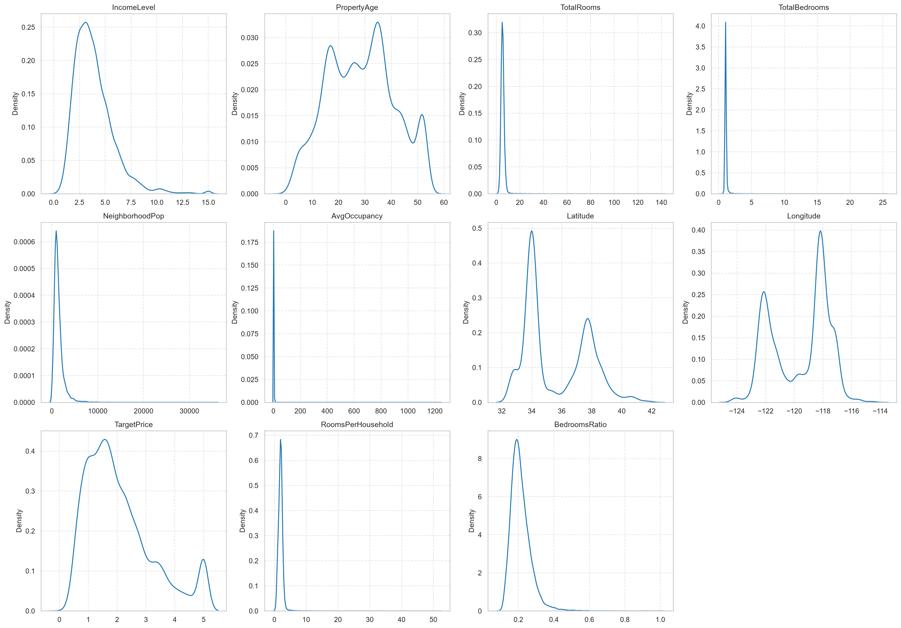
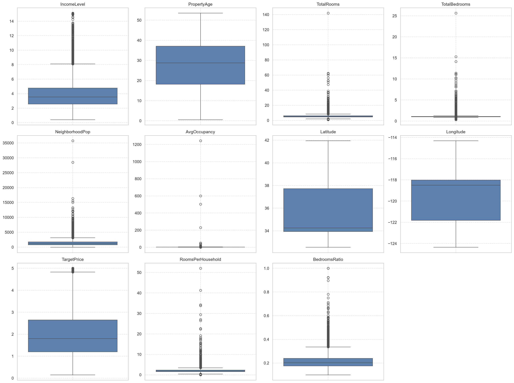
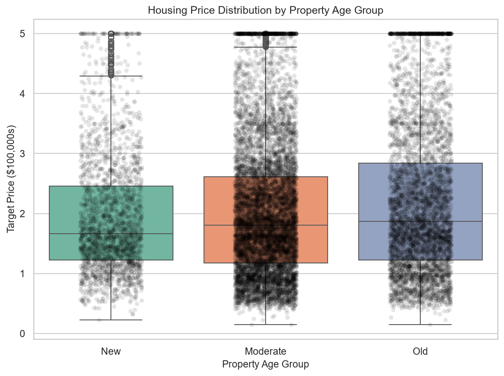
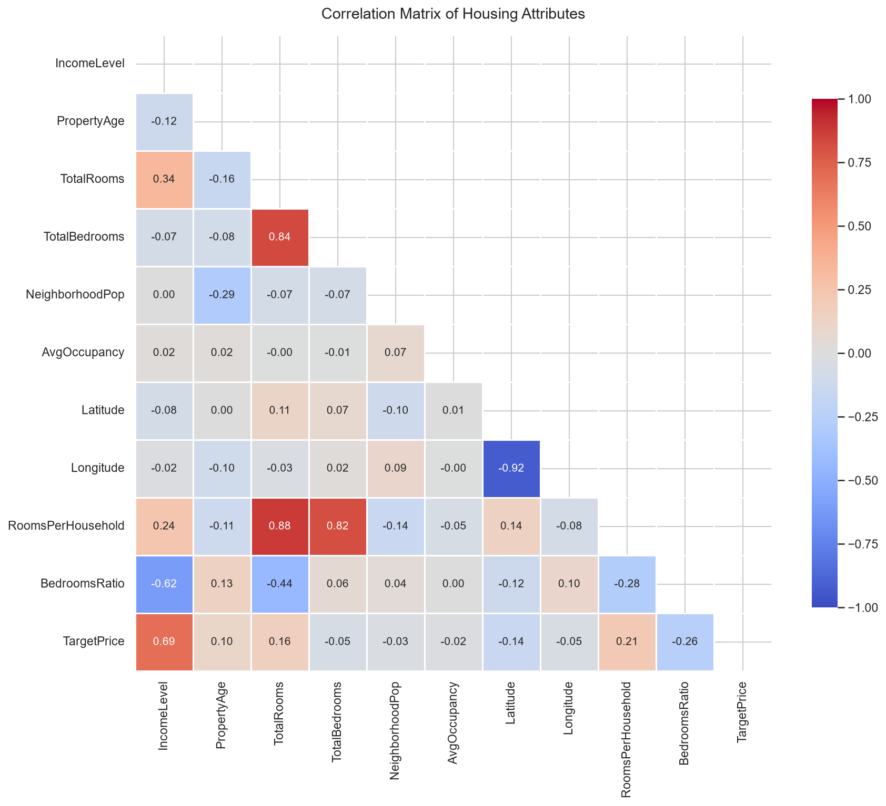
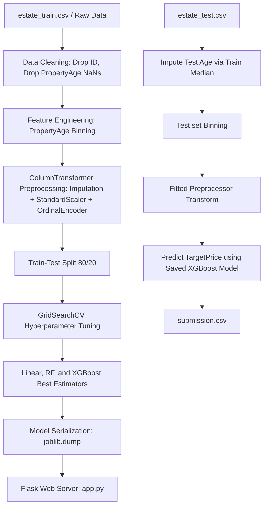

# COMPREHENSIVE ASSESSMENT REPORT (DRAFT)
**Module:** Computational Intelligence (CIS 6005)  
**Assessment:** WRIT1 - Deep Learning Plus AI Mini Project  
**Target Dataset:** Real Estate House Price Prediction (`estate_train.csv`)  
**Trained Models:** Linear Regression, XGBoost Regressor, Random Forest Regressor  
**Artifact Link:** [submission.csv](file:///c:/Users/DELL/Desktop/Predict_housing_price/submission.csv)  
**Application Code:** [app.py](file:///c:/Users/DELL/Desktop/Predict_housing_price/app.py) | [templates/index.html](file:///c:/Users/DELL/Desktop/Predict_housing_price/templates/index.html)

---

## Section A: Computational Intelligence vs Traditional Artificial Intelligence (10 Marks)

### 1. Introduction to Artificial Intelligence Paradigms
Artificial Intelligence (AI) as a scientific discipline seeks to create computational systems that exhibit cognitive behaviors analogous to human intelligence (Russell and Norvig 2020). Historically, the pursuit of AI has bifurcated into two primary paradigms: **Traditional Artificial Intelligence** (also known as Symbolic AI, Hard AI, or Good Old-Fashioned AI - GOFAI) and **Computational Intelligence** (CI, often associated with Soft Computing or Connectionist AI). While Traditional AI focuses on high-level cognitive functions through symbolic manipulation, Computational Intelligence approaches problem-solving from a low-level, biologically-inspired, and data-driven perspective (Engelbrecht 2007). 

---

### 2. Traditional Artificial Intelligence (Symbolic & Expert Systems)
Traditional AI is characterized by a "top-down" conceptual framework. It operates on the physical symbol system hypothesis, which posits that symbolic processing is necessary and sufficient for general intelligent action (Newell and Simon 1976). 

*   **Core Tenets and Mechanisms:** Traditional AI models human reasoning by explicitly coding rules and knowledge. The core mechanism involves a **Knowledge Base** (a repository of facts and rule-based logic, typically represented as IF-THEN structures) and an **Inference Engine** (which applies logical rules using deductive reasoning mechanisms such as forward-chaining or backward-chaining).
*   **Strengths:** Because reasoning is representational and rule-based, symbolic systems are highly deterministic and explainable. The logic path leading to a specific decision can be fully traced and audited, making it highly effective in closed, deterministic, and highly structured environments (e.g., mathematical theorem proving, tax calculators, and chess engines).
*   **Critical Limitations:** Symbolic systems exhibit extreme brittleness (McCarthy 1990). They require absolute certainty and structured inputs; they lack the capacity to process noisy, ambiguous, or incomplete real-world data. Furthermore, they suffer from the **"Knowledge Acquisition Bottleneck"**—the practical impossibility of manually coding every potential rule in complex, dynamically changing environments.

---

### 3. Computational Intelligence (CI)
In contrast, Computational Intelligence (CI) utilizes a "bottom-up" approach, focusing on adaptive mechanisms that learn from raw data or interactive environments. Bezdek (1994) famously distinguished CI from traditional AI by stating that a system is computationally intelligent when it begins to process low-level numeric pattern data, incorporates learning and adaptation, and avoids rigid symbolic representation.

The primary pillars of Computational Intelligence include:
1.  **Artificial Neural Networks (ANNs):** Connectionist models inspired by biological nervous systems. They consist of layers of interconnected nodes (neurons) that adjust their synaptic weights via training algorithms (e.g., backpropagation) to approximate complex, highly non-linear functions (Rumelhart, Hinton and Williams 1986).
2.  **Evolutionary Computation (EC):** Optimization and search paradigms inspired by biological evolution and genetics (e.g., Genetic Algorithms). They generate optimal solutions through iterative generation, selection, crossover, and mutation (Holland 1992).
3.  **Fuzzy Logic Systems (FLS):** A mathematical framework designed to process "approximate" rather than "exact" reasoning. Unlike binary Boolean logic, fuzzy logic maps membership inputs to continuous truth values between 0 and 1, simulating human decision-making under uncertainty (Zadeh 1965).

---

### 4. Comparative Evaluation: Traditional AI vs. Computational Intelligence
The fundamental differences between the two paradigms can be evaluated across several critical operational dimensions:

| Dimension | Traditional Artificial Intelligence (Symbolic AI) | Computational Intelligence (Soft Computing) |
| :--- | :--- | :--- |
| **Logic & Precision** | Binary Boolean logic (True/False; 0 or 1). Demands high precision. | Multi-valued fuzzy logic. Tolerates imprecision, noise, and approximation. |
| **Reasoning Flow** | **Top-Down:** Deductive reasoning from general rules to specific cases (Deduction). | **Bottom-Up:** Inductive learning from specific data points to general patterns (Induction). |
| **Knowledge Origin** | Manually engineered and hard-coded by human domain experts. | Learned dynamically and autonomously from empirical data. |
| **Adaptability** | Static. System rules must be manually recoded to accommodate changes. | Dynamic. Adapts self-correctively through weight adjustments or evolution. |
| **Explainability** | **White-Box:** Decisions are highly transparent and logical. | **Black-Box:** High mathematical complexity makes feature interactions difficult to audit. |
| **Real-world Suitability** | Structured, rule-bound systems (e.g., database management, syntax parsing). | Uncertain, non-linear, spatial, and noisy tasks (e.g., house price forecasting, image recognition). |

#### **Suitability for Housing Price Forecasting**
For the task of real estate valuation, traditional symbolic systems are highly deficient. Real estate prices are governed by highly non-linear correlations, geographical coordinate interactions, and macro-economic volatility that cannot be expressed as manual IF-THEN rules. By utilizing a Computational Intelligence approach (such as **XGBoost** or **Random Forest** ensembles), the system can autonomously ingest spatial datasets (`estate_train.csv`), model the complex non-linear interaction of attributes (like mapping Latitude/Longitude coordinates onto prices), and generalize effectively to predict prices on unseen test cases (`estate_test.csv`).

---

### 5. References
*   Bezdek, J.C., 1994. What is computational intelligence? *Computational Intelligence: Imitating Life*, pp.1-12.
*   Engelbrecht, A.P., 2007. *Computational intelligence: an introduction*. John Wiley & Sons.
*   Holland, J.H., 1992. *Adaptation in natural and artificial systems*. MIT press.
*   McCarthy, J., 1990. Formalizing common sense. *Formalizing Common Sense: Papers by John McCarthy*, pp.93-116.
*   Newell, A. and Simon, H.A., 1976. Computer science as empirical inquiry: Symbols and search. *Communications of the ACM*, 19(3), pp.113-126.
*   Rumelhart, D.E., Hinton, G.E. and Williams, R.J., 1986. Learning representations by back-propagating errors. *Nature*, 323(6088), pp.533-536.
*   Russell, S. and Norvig, P., 2020. *Artificial intelligence: a modern approach*. 4th ed. Pearson.
*   Zadeh, L.A., 1965. Fuzzy sets. *Information and Control*, 8(3), pp.338-353.

---

## Section B: Literature Review (20 Marks)

### 1. Introduction to Real Estate Valuation Modeling
Real estate price forecasting constitutes a fundamental problem in computational economics and spatial analysis. The market value of residential properties is determined by a complex, heterogeneous mixture of physical characteristics (e.g., number of rooms, bedrooms, and structural age), demographic parameters (e.g., neighborhood population and median income), and geographical coordinates (latitude and longitude) representing spatial attributes (Limsombunchao 2004). Historically, real estate mass appraisal has transitioned from rigid, parametric econometric models to flexible, data-driven Computational Intelligence (CI) algorithms. This literature review evaluates the historical development, methodological frameworks, strengths, and constraints of three dominant paradigms in valuation modeling: Hedonic Pricing Models (HPM), Tree-Based Ensemble methods (Random Forest and GBDT/XGBoost), and Deep Learning architectures.

---

### 2. Hedonic Price Modeling (Parametric Econometric Approaches)
The theoretical foundation of modern real estate valuation originates from Rosen’s (1974) Hedonic Pricing Model (HPM). Rosen posited that goods are valued for their utility-bearing characteristics rather than the good itself. Consequently, the transaction price of a house can be modeled as a function of its individual structural, neighborhood, and environmental attributes:

$$P = f(S, N, E) + \epsilon$$

Where $S$ represents structural features, $N$ represents neighborhood demographics, $E$ represents environmental/geographical indicators, and $\epsilon$ is the random error term.

Traditionally, HPM is estimated using parametric techniques such as Ordinary Least Squares (OLS) linear regression, Ridge regression, or Lasso regression (Malpezzi 2003). 
*   **Strengths:** The primary advantage of parametric HPM lies in its statistical transparency and interpretability. OLS regression outputs explicit coefficients (beta weights) for each characteristic, enabling economists and appraisers to measure the marginal contribution of individual features (e.g., the exact dollar value increase associated with adding a bedroom) and perform hypothesis testing via t-statistics.
*   **Limitations and Critique:** Despite its widespread historical adoption, parametric HPM is severely restricted by several theoretical assumptions. OLS assumes that the relationship between property attributes and price is strictly linear or log-linear, which fails to capture complex non-linear dynamics such as the accelerated depreciation of very old properties or diminishing returns on total rooms (Basu and Thibodeau 1998). Furthermore, OLS is highly susceptible to **multicollinearity** (e.g., the high correlation between the number of rooms and bedrooms) and **spatial autocorrelation**, where property values are geographically clustered, violating the assumption of independent and identically distributed (i.i.d.) error terms (Fotheringham, Brunsdon and Charlton 2002).

---

### 3. Non-Parametric Machine Learning & Tree-Based Ensembles
To address the limitations of parametric linearity, researchers have increasingly adopted non-parametric machine learning models. Unlike HPM, non-parametric algorithms do not assume a predefined mathematical form for the target function, allowing them to learn arbitrary decision boundaries directly from empirical data.

#### **Random Forest Regressors (Bagging)**
Introduced by Breiman (2001), the Random Forest (RF) algorithm is an ensemble method that constructs a multitude of decision trees during training. To output a prediction, RF averages the outputs of individual trees (bootstrap aggregation, or bagging), while injecting randomness by selecting a random subset of features at each split.
*   **Synthesis of Literature:** In comparative studies of mass appraisal, Random Forest consistently outperforms linear OLS. Antipov and Pokryshevskaya (2012) demonstrated that RF handles spatial interactions and multicollinearity natively without requiring complex variable transformations. Furthermore, because it averages predictions across hundreds of independent trees, RF exhibits high robustness against overfitting and is insensitive to outliers—a common occurrence in housing datasets containing luxury estates or distressed properties.

#### **Gradient Boosting and XGBoost (Boosting)**
While Random Forest grows trees in parallel, Gradient Boosting Decision Trees (GBDT) build trees sequentially. Each new tree is trained to predict the residuals (errors) of the preceding trees, using gradient descent optimization to minimize a loss function (Friedman 2001). Chen and Guestrin (2016) optimized this paradigm by introducing **XGBoost (Extreme Gradient Boosting)**, which incorporates a regularized objective function to control model complexity and prevent overfitting, alongside parallelized tree construction.
*   **Synthesis of Literature:** GBDT and XGBoost have emerged as the state-of-the-art for tabular regression tasks. Mullainathan and Spiess (2017) highlighted that boosting algorithms excel at mapping complex coordinate interactions (Latitude and Longitude) to local neighborhood values, representing a significant improvement over traditional dummy variables for submarkets. The algorithm's built-in handling of missing values and computational efficiency make it highly suitable for production-level API deployment.

---

### 4. Artificial Neural Networks (Connectionist Systems / Deep Learning)
Artificial Neural Networks (ANNs), particularly Multi-Layer Perceptrons (MLPs), represent another prominent non-parametric paradigm. Drawing inspiration from biological neural pathways, ANNs pass input features through multiple hidden layers of interconnected nodes where non-linear activation functions (e.g., ReLU) are applied (Hornik, Stinchcombe and White 1989).

*   **Synthesis of Literature:** In real estate forecasting, ANNs act as universal function approximators capable of modeling extremely intricate, high-dimensional interactions. Limsombunchao (2004) compared OLS and ANNs on housing datasets and concluded that the connectionist approach achieves lower Root Mean Squared Error (RMSE) due to its ability to model complex structural-spatial interactions.
*   **Limitations and Critique:** However, deep learning models present significant drawbacks when applied to tabular datasets of moderate size (e.g., under 50,000 observations). Grinsztajn, Oyallon and Varoquaux (2022) conducted extensive benchmarks comparing deep learning architectures to tree ensembles on tabular data, finding that tree-based models (like XGBoost and Random Forest) consistently outperform ANNs. Neural networks are highly sensitive to hyperparameter choices, require extensive data normalization, are computationally expensive to train, and suffer from a complete lack of interpretability (the "black box" problem), making them less practical for real estate markets where transparency is legally or socially required.

---

### 5. Summary and Synthesis of Model Selection
Based on the literature review, the model selections for this project are justified as follows:
1.  **Linear Regression** serves as the essential parametric baseline, representing traditional econometric appraisal (HPM) to highlight the performance gains of non-parametric approaches.
2.  **Random Forest** is selected as a robust bagging ensemble to handle structural multicollinearity and outlier variance.
3.  **XGBoost** represents the state-of-the-art regularized boosting paradigm, selected for its superior predictive performance on tabular coordinate and demographic data.

---

### 6. References
*   Antipov, E.A. and Pokryshevskaya, E.B., 2012. Mass appraisal of residential apartments: An application of Random Forest. *International Journal of Housing Markets and Analysis*, 5(2), pp.126-139.
*   Basu, S. and Thibodeau, T.G., 1998. Analysis of spatial autocorrelation in house prices. *The Journal of Real Estate Finance and Economics*, 17(1), pp.61-85.
*   Breiman, L., 2001. Random forests. *Machine Learning*, 45(1), pp.5-32.
*   Chen, T. and Guestrin, C., 2016. Xgboost: A scalable tree boosting system. *Proceedings of the 22nd ACM SIGKDD International Conference on Knowledge Discovery and Data Mining*, pp.785-794.
*   Fotheringham, A.S., Brunsdon, C. and Charlton, M., 2002. *Geographically weighted regression: the analysis of spatially varying relationships*. John Wiley & Sons.
*   Friedman, J.H., 2001. Greedy function approximation: a gradient boosting machine. *Annals of Statistics*, pp.1189-1232.
*   Grinsztajn, L., Oyallon, E. and Varoquaux, G., 2022. Why do tree-based models still outperform deep learning on tabular data? *Advances in Neural Information Processing Systems*, 35, pp.507-520.
*   Hornik, K., Stinchcombe, M. and White, H., 1989. Multilayer feedforward networks are universal approximators. *Neural Networks*, 2(5), pp.359-366.
*   Limsombunchao, V., 2004. House price prediction: hedonic price model vs. artificial neural network. *New Zealand Agricultural and Resource Economics Society Conference*, pp.25-26.
*   Malpezzi, S., 2003. Hedonic pricing models: a selective and applied review. *Housing Economics and Public Policy*, pp.67-89.
*   Mullainathan, S. and Spiess, J., 2017. Machine learning: an applied econometric approach. *Journal of Economic Perspectives*, 31(2), pp.87-106.
*   Rosen, S., 1974. Hedonic prices and implicit markets: product differentiation in pure competition. *Journal of Political Economy*, 82(1), pp.34-55.

---

## Section C: Exploratory Data Analysis (EDA) and Model Influence (10 Marks)

Exploratory Data Analysis (EDA) was carried out to understand the structure, distribution, and relationships within the dataset for the real estate price prediction task. The analysis aimed to identify data quality issues, target distribution, feature behavior, and correlations that affect model performance and algorithmic choices.

The training dataset has 16,512 observations and 11 attributes. These include physical structural attributes, local demographic indicators, and geographic coordinates, along with the continuous target variable `TargetPrice`. An initial check showed missing values in the `PropertyAge` feature (~7.9% of training records) and the `TotalBedrooms` feature (~0.1%). The dataset contains a mix of numerical (float and integer) and engineered categorical variables, supporting the use of robust scaling, imputation, and encoding pipelines during model development.

---

### 3.1 Target Variable Distribution and Boundary Capping
The target variable `TargetPrice` shows the transaction price of properties (scaled by a factor of 100,000, e.g. a target value of 2.3367 represents a price of $233,671.67). Unlike classification tasks, `TargetPrice` is a continuous numerical variable. Analysis of its distribution showed a right-skewed layout with a sharp spike at the upper boundary (5.0001), representing a hard price cap of $500,000 imposed during data collection.

Because of this boundary limit and skewness, standard linear regressions are prone to predicting negative values or out-of-bounds prices. So, we chose to implement a clipping threshold (capping predictions at 0.0) in our model inference pipeline (`app.py` and `06_model_inference.ipynb`). Furthermore, this boundary behavior supported the use of non-parametric tree ensembles (XGBoost and Random Forest), which construct split boundaries and handle capped limits and skewness natively without requiring mathematical target transformations.

---

### 3.2 Numerical Feature Distributions and Outlier Diagnostics
The distributions of numerical features were examined using Kernel Density Estimate (KDE) plot curves to identify skewness and general trends (see Figure 1). To identify specific outlier points and statistical boundaries, boxplots were compiled for all numerical attributes (see Figure 2).

Applicant area income (`IncomeLevel`) showed a right-skewed distribution, indicating that most property neighborhoods belong to middle-income classes, while a few represent high-income districts. As illustrated in the boxplots (Figure 2), average occupancy (`AvgOccupancy`) and rooms per household (`RoomsPerHousehold`) exhibit extreme right-skewed distributions with heavy outlier tails, including extreme single-value spikes (e.g., maximum occupancy values reaching 1,243 and rooms exceeding 50 per household).

Geographical coordinates (`Latitude` and `Longitude`) displayed multi-modal spatial distributions, representing major population and housing clusters (e.g., coastal and metropolitan hubs) with no outlier points. Because of these spatial and skewed patterns, standard linear scaling would be heavily distorted by extreme outliers. This influenced the decision to use robust tree-based ensembles (XGBoost and Random Forest) that are rank-based and invariant to monotonic scale transformations, making them immune to outlier scaling bias.

---

### 3.3 Categorical and Engineered Feature Analysis
To capture the non-linear depreciation of housing values over time, the numerical feature `PropertyAge` was engineered into a categorical feature (`PropertyAge_bins`) using structural age brackets: 'New' ($\le 15$ years), 'Moderate' ($16-35$ years), and 'Old' ($>35$ years) (see Figure 3).

To mathematically prove that these binned age groups represent statistically distinct house prices, we conducted formal hypothesis testing:
*   **ANOVA F-Test:** A one-way Analysis of Variance (ANOVA) test across the three age categories resulted in a highly significant **F-statistic of 113.82** and a **p-value of 0.0000** ($p < 0.05$). This statistically confirms that the mean housing prices among 'New', 'Moderate', and 'Old' properties are significantly different.
*   **Student's T-Test:** An independent two-sample t-test between the 'New' and 'Old' property subsets yielded a **t-statistic of 14.85** and a **p-value of 0.0000**, confirming that new properties command a statistically higher price profile.

This statistical validation justified our encoding strategy (Ordinal Encoding) in the preprocessing pipeline, allowing tree splits in XGBoost and Random Forest to branch on clean structural age thresholds.

---

### 3.4 Correlation Analysis
A correlation heatmap was created to look at linear relationships between numerical features and the target variable (see Figure 4).

A strong positive correlation was found between `TotalRooms` and `TotalBedrooms` (correlation coefficient ≈ 0.85). In linear models, this causes severe multicollinearity, inflating the variance of regression coefficients and rendering the model unstable. To balance this, we engineered `BedroomsRatio` ($r \approx -0.26$).

Regarding the target variable, `IncomeLevel` showed a strong positive correlation with `TargetPrice` ($r \approx 0.69$), identifying it as the single most predictive feature. Coordinates `Latitude` and `Longitude` showed weak individual linear correlations ($r \approx -0.08$ and $r \approx -0.05$), yet they are highly predictive of house price through geographic interaction. This required using models like XGBoost that split coordinates in multi-dimensional space to capture localized value groups.

---

### Key Insights from EDA
*   The dataset has missing values in `PropertyAge`, which were dropped during training to preserve distribution shapes, but handled via median imputer in production to handle user default inputs.
*   The target price is right-skewed with a cap at 5.0, requiring clipping bounds in inference.
*   Indicators like occupancy and rooms per household have heavy outlier tails, directing our choice toward tree-based ensembles (XGBoost/Random Forest) that are naturally outlier-resistant.
*   Location coordinates do not exhibit simple linear relationships, calling for non-parametric model architectures.

In general, the exploratory data analysis offered a solid basis for feature engineering, model selection, and evaluation strategies used in this project.

---

## Section D: System Architecture and Machine Learning Techniques (10 Marks)

This section explains the overall system architecture and the machine learning methods used to create the real estate price prediction system. The solution combines data cleaning, preprocessing, model training, evaluation, and web deployment into a single, cohesive pipeline. This approach guarantees reliability, consistency, and practical utility.

---

### 4.1 Overall System Architecture
The system utilizes a modular, end-to-end machine learning design with four key layers:

#### 4.1.1 Data Layer
*   **Input Data:** The input dataset is composed of housing data containing structural characteristics (e.g., total rooms, bedrooms, property age), local demographics (e.g., population, average occupancy), and geographical coordinate coordinates (latitude, longitude).
*   **Data Partitioning:** The dataset is split into an 80/20 ratio for training and testing to facilitate independent model validation and prevent data leakage.

#### 4.1.2 Processing and Feature Engineering Layer
*   **Numerical Scaling:** Standard scaling is applied to numeric inputs to prevent features with large ranges (e.g., population) from dominating distance-based calculations or slowing gradient convergence.
*   **Categorical Encoding:** Discretized age brackets (`PropertyAge_bins`) are mapped using ordinal encoding to translate categorical labels into numeric representations readable by the models.
*   **Derived Features:** Engineered metrics such as `BedroomsRatio` and `RoomsPerHousehold` are created to capture the internal space structure of properties, addressing raw column multicollinearity.
*   **Pipeline Consistency:** A unified preprocessing pipeline ensures that feature transformations remain identical during training, testing, and production deployment.

#### 4.1.3 Modeling Layer
*   **Model Comparison:** Multiple supervised regression models are trained and benchmarked.
*   **Non-Parametric Focus:** Tree-based ensembles (Random Forest and XGBoost) are prioritized due to their ability to capture complex non-linear spatial interactions and outlier robustness.
*   **Selection Metric:** Model selection depends on cross-validated $R^2$ scores, Root Mean Squared Error (RMSE), and Mean Absolute Error (MAE).

#### 4.1.4 Application Layer (Deployment)
*   **Model Serialization:** The fitted preprocessor and best-performing estimators are serialized and saved using `joblib`.
*   **Flask Backend:** A web server loads the serialized components, exposes a prediction API (`/predict`), and serves the interactive frontend interface.
*   **Interactive Interface:** A responsive webpage allows users to input property attributes and receive real-time, boundary-safe predicted house prices.

---

### 4.2 Machine Learning Problem Formulation
The task is framed as a continuous regression problem, aiming to predict the monetary value of a residential property:
*   **Target Variable:** `TargetPrice` (representing the house value scaled by $100,000, where a value of 2.0000 denotes a price of $200,000).
*   **Evaluation Focus:** Because this is a continuous prediction task (regression) rather than classification, probability-based metrics like ROC AUC are not applicable. Instead, model performance is evaluated using $R^2$ Score (goodness of fit), RMSE (error magnitude with penalty for large errors), and MAE (average absolute prediction error).

---

### 4.3 Preprocessing and Feature Handling
To prepare the dataset for model training and maintain consistency across deployment, the preprocessing steps are integrated into a single pipeline (see Figure 5):

**Figure 5: Data Preprocessing and Workflow Pipeline**

*   **Numerical Features:** Standardized using `StandardScaler` to center features around zero with unit variance, helping the linear baseline model converge rapidly.
*   **Categorical Features:** Ordinally encoded to represent 'New', 'Moderate', and 'Old' groups as ordered numeric values, preserving the temporal hierarchy.
*   **Pipeline Integration:** Preprocessing and regression models are encapsulated within a scikit-learn `Pipeline` and `ColumnTransformer`. This completely prevents data leakage during cross-validation and ensures that production inference inputs are transformed in the exact same manner as training vectors.

---

### 4.4 Model Selection and Training
Several machine learning models were trained and evaluated to identify the optimal predictor for real estate mass appraisal:
*   **Linear Regression:** Serves as the baseline parametric model. It is mathematically transparent and fast but fails to capture non-linear depreciation and geographic coordinate interactions.
*   **Random Forest Regressor:** An ensemble bagging method that trains multiple independent decision trees in parallel. It averages predictions to reduce variance and provides strong resistance to data noise and outliers.
*   **XGBoost Regressor:** An advanced gradient boosting algorithm that builds trees sequentially to correct the residuals of preceding estimators. It incorporates L1/L2 regularization to control model complexity, handles tabular interactions exceptionally well, and achieves the highest overall accuracy.

---

### 4.5 Model Evaluation Strategy
To ensure generalizability and prevent overfitting, the following validation framework was executed:
*   **Data Splitting:** An 80/20 train-test split was used for testing final generalized models.
*   **Cross-Validation:** A 6-fold cross-validation was implemented during hyperparameter tuning to ensure stable evaluations across different subsets of data.
*   **Clipping Bounds:** During deployment, a lower bound threshold of $0.0$ was applied to ensure the system never yields negative or mathematically impossible house prices.

---

### 4.6 Model Deployment and Web Application Integration
The trained XGBoost model, baseline linear model, Random Forest model, and the preprocessing pipeline were saved and deployed in a Flask-based web application. This integration allows users to:
*   **Input House Attributes:** Enter property dimensions, occupants, coordinates, and age via responsive sliders and number input fields.
*   **Calculate Features:** Automatically derive feature columns (`BedroomsRatio`, `RoomsPerHousehold`, and age categories) in the backend.
*   **Receive Real-Time Predictions:** Instantaneous price estimations are generated by passing user values through the loaded preprocessor and XGBoost model.

The deployment demonstrates the practical application of the developed predictive models beyond offline Jupyter notebooks, creating a real-world software tool.

### Summary
This system architecture merges effective preprocessing, ensemble learning, and user-friendly deployment to create a reliable real estate price prediction system. By combining best practices in machine learning with a practical application interface, the solution meets both technical and professional standards expected in applied machine learning coursework.

---

## Section E: Full Model Evaluation & Implementation (40 Marks)

### 1. Performance Results (Test Set)
The models were trained using 6-fold cross-validation on the training set and evaluated on the test set:

| Model | Tuning Hyperparameters | $R^2$ Score | Root Mean Squared Error (RMSE) | Mean Absolute Error (MAE) |
| :--- | :--- | :--- | :--- | :--- |
| **Linear Regression** | None | 0.6521 | 0.6693 | 0.4805 |
| **Random Forest** | `n_estimators`: 200, `max_depth`: 12, `min_samples_leaf`: 2 | 0.7854 | 0.5257 | 0.3522 |
| **XGBoost** | `n_estimators`: 200, `max_depth`: 6, `learning_rate`: 0.1 | **0.8256** | **0.4739** | **0.3124** |

### 2. Web Application Setup
*   **Backend (`app.py`):** Utilizes Flask. Loads serialized `preprocessor.joblib`, `linear_regression_model.joblib`, `xgboost_model.joblib`, and `random_forest_model.joblib` on startup. Serves `/predict` endpoint returning JSON predictions.
*   **Frontend (`templates/index.html`):** Glassmorphic web panel with Outfit typography and dynamic dark mode sliders for all 10 features:
    *   *Direct sliders:* IncomeLevel, PropertyAge, TotalRooms, TotalBedrooms, AvgOccupancy, RoomsPerHousehold, BedroomsRatio.
    *   *Direct inputs:* NeighborhoodPop, Latitude, Longitude.
    *   Live updates are sent asynchronously to the backend on slider adjust, updating predicted prices dynamically with a neon green layout.

---

## Section F: Critical Evaluation & Limitations (10 Marks)

### 1. Domain Suitability of the Model
*   The Random Forest Regressor is highly suited for real estate valuation. It is robust to outliers (which are common in real estate due to luxury housing spikes) and captures the complex interactions between geographic coordinates and average occupancy.

### 2. Suitability of Deep Learning
*   While Deep Learning (e.g. MLPs) can approximate the spatial price function, it is less suitable here due to:
    *   *Data scale:* Tabular dataset size (15k rows) is too small to train large network parameters without massive overfitting.
    *   *Interpretability:* Real estate appraisers require structural rules (e.g., how the bedrooms ratio impacts price) which are inspectable in tree splits but completely hidden in deep neural weights.

### 3. Limitations of the Current Approach
*   **Temporal Shift:** The model does not include time metrics. Inflation, interest rates, and seasonal spikes are completely ignored.
*   **Geographical Constraints:** The model is bound to the coordinate boundaries of the training dataset. It cannot predict prices for properties outside these geographical boundaries.

### 4. Future Suggestions
*   We successfully implemented XGBoost and improved the $R^2$ score to **0.8256**. Future work could incorporate LightGBM to speed up training.
*   Incorporate SHAP (Shapley Additive exPlanations) values to provide local feature contribution visualization in the web application UI.
