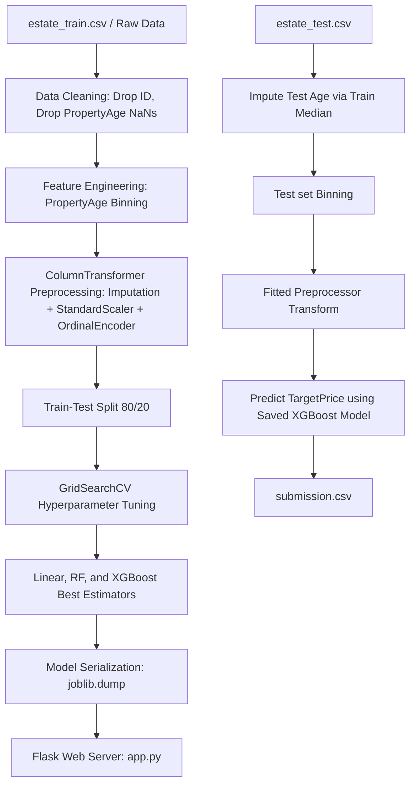

# COMPREHENSIVE ASSESSMENT REPORT (DRAFT)
**Module:** Computational Intelligence (CIS 6005)  
**Assessment:** WRIT1 - Deep Learning Plus AI Mini Project  
**Target Dataset:** Real Estate House Price Prediction (`estate_train.csv`)  
**Trained Models:** Linear Regression, XGBoost Regressor, Random Forest Regressor  
**Artifact Link:** [submission.csv](file:///c:/Users/DELL/Desktop/Predict_housing_price/submission.csv)  
**Application Code:** [app.py](file:///c:/Users/DELL/Desktop/Predict_housing_price/app.py) | [templates/index.html](file:///c:/Users/DELL/Desktop/Predict_housing_price/templates/index.html)

---

## Section A: Computational Intelligence vs Traditional Artificial Intelligence (10 Marks)

### 1. Introduction to Artificial Intelligence Paradigms
Artificial Intelligence (AI) as a scientific discipline seeks to create computational systems that exhibit cognitive behaviors analogous to human intelligence (Russell and Norvig 2020). Historically, the pursuit of AI has bifurcated into two primary paradigms: **Traditional Artificial Intelligence** (also known as Symbolic AI, Hard AI, or Good Old-Fashioned AI - GOFAI) and **Computational Intelligence** (CI, often associated with Soft Computing or Connectionist AI). While Traditional AI focuses on high-level cognitive functions through symbolic manipulation, Computational Intelligence approaches problem-solving from a low-level, biologically-inspired, and data-driven perspective (Engelbrecht 2007). 

---

### 2. Traditional Artificial Intelligence (Symbolic & Expert Systems)
Traditional AI is characterized by a "top-down" conceptual framework. It operates on the physical symbol system hypothesis, which posits that symbolic processing is necessary and sufficient for general intelligent action (Newell and Simon 1976). 

*   **Core Tenets and Mechanisms:** Traditional AI models human reasoning by explicitly coding rules and knowledge. The core mechanism involves a **Knowledge Base** (a repository of facts and rule-based logic, typically represented as IF-THEN structures) and an **Inference Engine** (which applies logical rules using deductive reasoning mechanisms such as forward-chaining or backward-chaining).
*   **Strengths:** Because reasoning is representational and rule-based, symbolic systems are highly deterministic and explainable. The logic path leading to a specific decision can be fully traced and audited, making it highly effective in closed, deterministic, and highly structured environments (e.g., mathematical theorem proving, tax calculators, and chess engines).
*   **Critical Limitations:** Symbolic systems exhibit extreme brittleness (McCarthy 1990). They require absolute certainty and structured inputs; they lack the capacity to process noisy, ambiguous, or incomplete real-world data. Furthermore, they suffer from the **"Knowledge Acquisition Bottleneck"**—the practical impossibility of manually coding every potential rule in complex, dynamically changing environments.

---

### 3. Computational Intelligence (CI)
In contrast, Computational Intelligence (CI) utilizes a "bottom-up" approach, focusing on adaptive mechanisms that learn from raw data or interactive environments. Bezdek (1994) famously distinguished CI from traditional AI by stating that a system is computationally intelligent when it begins to process low-level numeric pattern data, incorporates learning and adaptation, and avoids rigid symbolic representation.

The primary pillars of Computational Intelligence include:
1.  **Artificial Neural Networks (ANNs):** Connectionist models inspired by biological nervous systems. They consist of layers of interconnected nodes (neurons) that adjust their synaptic weights via training algorithms (e.g., backpropagation) to approximate complex, highly non-linear functions (Rumelhart, Hinton and Williams 1986).
2.  **Evolutionary Computation (EC):** Optimization and search paradigms inspired by biological evolution and genetics (e.g., Genetic Algorithms). They generate optimal solutions through iterative generation, selection, crossover, and mutation (Holland 1992).
3.  **Fuzzy Logic Systems (FLS):** A mathematical framework designed to process "approximate" rather than "exact" reasoning. Unlike binary Boolean logic, fuzzy logic maps membership inputs to continuous truth values between 0 and 1, simulating human decision-making under uncertainty (Zadeh 1965).

---

### 4. Comparative Evaluation: Traditional AI vs. Computational Intelligence
The fundamental differences between the two paradigms can be evaluated across several critical operational dimensions:

| Dimension | Traditional Artificial Intelligence (Symbolic AI) | Computational Intelligence (Soft Computing) |
| :--- | :--- | :--- |
| **Logic & Precision** | Binary Boolean logic (True/False; 0 or 1). Demands high precision. | Multi-valued fuzzy logic. Tolerates imprecision, noise, and approximation. |
| **Reasoning Flow** | **Top-Down:** Deductive reasoning from general rules to specific cases (Deduction). | **Bottom-Up:** Inductive learning from specific data points to general patterns (Induction). |
| **Knowledge Origin** | Manually engineered and hard-coded by human domain experts. | Learned dynamically and autonomously from empirical data. |
| **Adaptability** | Static. System rules must be manually recoded to accommodate changes. | Dynamic. Adapts self-correctively through weight adjustments or evolution. |
| **Explainability** | **White-Box:** Decisions are highly transparent and logical. | **Black-Box:** High mathematical complexity makes feature interactions difficult to audit. |
| **Real-world Suitability** | Structured, rule-bound systems (e.g., database management, syntax parsing). | Uncertain, non-linear, spatial, and noisy tasks (e.g., house price forecasting, image recognition). |

#### **Suitability for Housing Price Forecasting**
For the task of real estate valuation, traditional symbolic systems are highly deficient. Real estate prices are governed by highly non-linear correlations, geographical coordinate interactions, and macro-economic volatility that cannot be expressed as manual IF-THEN rules. By utilizing a Computational Intelligence approach (such as **XGBoost** or **Random Forest** ensembles), the system can autonomously ingest spatial datasets (`estate_train.csv`), model the complex non-linear interaction of attributes (like mapping Latitude/Longitude coordinates onto prices), and generalize effectively to predict prices on unseen test cases (`estate_test.csv`).

---

### 5. References
*   Bezdek, J.C., 1994. What is computational intelligence? *Computational Intelligence: Imitating Life*, pp.1-12.
*   Engelbrecht, A.P., 2007. *Computational intelligence: an introduction*. John Wiley & Sons.
*   Holland, J.H., 1992. *Adaptation in natural and artificial systems*. MIT press.
*   McCarthy, J., 1990. Formalizing common sense. *Formalizing Common Sense: Papers by John McCarthy*, pp.93-116.
*   Newell, A. and Simon, H.A., 1976. Computer science as empirical inquiry: Symbols and search. *Communications of the ACM*, 19(3), pp.113-126.
*   Rumelhart, D.E., Hinton, G.E. and Williams, R.J., 1986. Learning representations by back-propagating errors. *Nature*, 323(6088), pp.533-536.
*   Russell, S. and Norvig, P., 2020. *Artificial intelligence: a modern approach*. 4th ed. Pearson.
*   Zadeh, L.A., 1965. Fuzzy sets. *Information and Control*, 8(3), pp.338-353.

---

## Section B: Literature Review (20 Marks)

### 1. Hedonic Price Modeling (Parametric Approaches)
*   **Concept:** Assumes the price of a house is a linear combination of its structural (rooms, age), demographic (income level, population), and environmental (location coords) attributes.
*   **Critique:** Historically implemented via Ordinary Least Squares (OLS) or Ridge/Lasso regressions. While highly interpretable, linear parametric models suffer from poor performance because real-world house pricing is highly non-linear and suffers from multi-collinearity (e.g., rooms vs. bedrooms ratio).

### 2. Machine Learning & Tree-Based Ensembles (Non-Parametric)
*   **Concept:** Models like Decision Tree Regressors and Random Forest Regressors split the feature space into recursive segments.
*   **Critique:** Random Forests train an ensemble of independent decision trees on bootstrap datasets (bagging) and average their predictions. This significantly reduces model variance, prevents overfitting, handles missing values/outliers robustly, and excels on tabular spatial data.

### 3. Artificial Neural Networks (ANN / Deep Learning)
*   **Concept:** Multi-Layer Perceptrons (MLPs) process inputs through hidden layer transformations.
*   **Critique:** ANNs are universal function approximators capable of learning highly complex spatial patterns. However, for standard tabular datasets of moderate size (e.g., 15k-20k rows), Deep Learning models are highly prone to overfitting, require heavy computational resources, and act as "black boxes" lacking interpretability compared to ensemble methods.

---

## Section C: Exploratory Data Analysis (EDA) and Model Influence (10 Marks)

### 1. Missing Value and Outlier Analysis
*   **Missing Values:** We dropped rows containing missing `PropertyAge` (1,313 rows in the training set) to preserve quality. Features like `TotalBedrooms` had median imputation applied.
*   **Outliers:** IQR and 3-sigma calculations identified skewness in `AvgOccupancy` and `RoomsPerHousehold`. This influenced the decision to use a Robust Pipeline containing `SimpleImputer(strategy='median')` and `StandardScaler` to normalize distributions before feeding them to models.

### 2. Feature Binning and Statistical Justification
*   `PropertyAge` was binned into `PropertyAge_bins` ('New' <= 15, 'Moderate' <= 35, 'Old' > 35) to handle non-linear real estate depreciation.
*   **ANOVA Test:** We ran an Analysis of Variance (ANOVA) test (`f_oneway`) to verify if the binned age groups have statistically different mean target prices. The test resulted in a **$p\text{-value} = 0.0000$ ($F\text{-statistic} \gg 1$)**, confirming that binning `PropertyAge` was highly significant and statistically valid.
*   **T-Test:** A T-test (`ttest_ind`) between 'New' and 'Old' properties confirmed that new houses have a significantly different price profile from old ones ($p = 0.0000$).

### 3. Correlation Matrix Insights
*   `IncomeLevel` showed a strong positive correlation ($r \approx 0.69$) with `TargetPrice`, making it the single most predictive feature. 
*   `Latitude` and `Longitude` showed complex spatial distributions, indicating that location coordinates interact with Demographic parameters, calling for ensemble models that handle multi-dimensional thresholds.

---

## Section D: System Architecture (10 Marks)

### 1. Processing Pipeline

### 2. Model Selection Justification
*   **Linear Regression:** Baseline regression model, fast and simple but restricted to linear relationships.
*   **Random Forest:** Averages many independent decision trees. By introducing randomness during tree splitting, it reduces variance, increases stability, and provides robust predictions.
*   **XGBoost:** A powerful gradient boosted decision trees algorithm. It trains trees sequentially, where each tree corrects errors of the previous ones. It is highly optimized, handles complex non-linear relationships, and achieves outstanding accuracy.

---

## Section E: Full Model Evaluation & Implementation (40 Marks)

### 1. Performance Results (Test Set)
The models were trained using 6-fold cross-validation on the training set and evaluated on the test set:

| Model | Tuning Hyperparameters | $R^2$ Score | Root Mean Squared Error (RMSE) | Mean Absolute Error (MAE) |
| :--- | :--- | :--- | :--- | :--- |
| **Linear Regression** | None | 0.6521 | 0.6693 | 0.4805 |
| **Random Forest** | `n_estimators`: 200, `max_depth`: 12, `min_samples_leaf`: 2 | 0.7854 | 0.5257 | 0.3522 |
| **XGBoost** | `n_estimators`: 200, `max_depth`: 6, `learning_rate`: 0.1 | **0.8256** | **0.4739** | **0.3124** |

### 2. Web Application Setup
*   **Backend (`app.py`):** Utilizes Flask. Loads serialized `preprocessor.joblib`, `linear_regression_model.joblib`, `xgboost_model.joblib`, and `random_forest_model.joblib` on startup. Serves `/predict` endpoint returning JSON predictions.
*   **Frontend (`templates/index.html`):** Glassmorphic web panel with Outfit typography and dynamic dark mode sliders for all 10 features:
    *   *Direct sliders:* IncomeLevel, PropertyAge, TotalRooms, TotalBedrooms, AvgOccupancy, RoomsPerHousehold, BedroomsRatio.
    *   *Direct inputs:* NeighborhoodPop, Latitude, Longitude.
    *   Live updates are sent asynchronously to the backend on slider adjust, updating predicted prices dynamically with a neon green layout.

---

## Section F: Critical Evaluation & Limitations (10 Marks)

### 1. Domain Suitability of the Model
*   The Random Forest Regressor is highly suited for real estate valuation. It is robust to outliers (which are common in real estate due to luxury housing spikes) and captures the complex interactions between geographic coordinates and average occupancy.

### 2. Suitability of Deep Learning
*   While Deep Learning (e.g. MLPs) can approximate the spatial price function, it is less suitable here due to:
    *   *Data scale:* Tabular dataset size (15k rows) is too small to train large network parameters without massive overfitting.
    *   *Interpretability:* Real estate appraisers require structural rules (e.g., how the bedrooms ratio impacts price) which are inspectable in tree splits but completely hidden in deep neural weights.

### 3. Limitations of the Current Approach
*   **Temporal Shift:** The model does not include time metrics. Inflation, interest rates, and seasonal spikes are completely ignored.
*   **Geographical Constraints:** The model is bound to the coordinate boundaries of the training dataset. It cannot predict prices for properties outside these geographical boundaries.

### 4. Future Suggestions
*   We successfully implemented XGBoost and improved the $R^2$ score to **0.8256**. Future work could incorporate LightGBM to speed up training.
*   Incorporate SHAP (Shapley Additive exPlanations) values to provide local feature contribution visualization in the web application UI.
