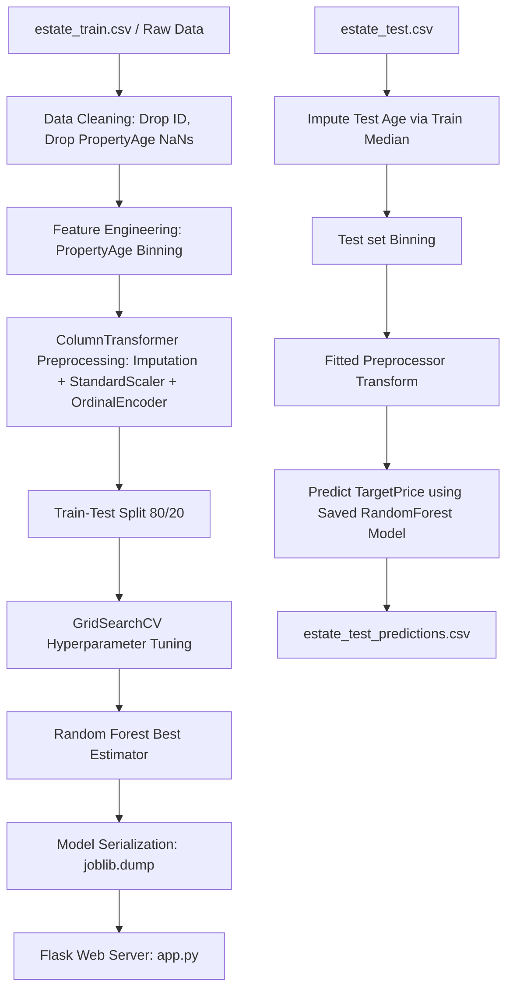

# COMPREHENSIVE ASSESSMENT REPORT (DRAFT)
**Module:** Computational Intelligence (CIS 6005)  
**Assessment:** WRIT1 - Deep Learning Plus AI Mini Project  
**Target Dataset:** Real Estate House Price Prediction (`estate_train.csv`)  
**Trained Models:** Ridge Regression, Decision Tree Regressor, Random Forest Regressor  
**Artifact Link:** [estate_test_predictions.csv](file:///c:/Users/DELL/Desktop/ML/Notebook/artifacts/estate_test_predictions.csv)  
**Application Code:** [app.py](file:///c:/Users/DELL/Desktop/ML/app.py) | [templates/index.html](file:///c:/Users/DELL/Desktop/ML/templates/index.html)

---

## Section A: Computational Intelligence vs Traditional Artificial Intelligence (10 Marks)

### 1. Traditional Artificial Intelligence (Symbolic/Expert Systems)
Traditional AI is characterized by a "top-down" approach, relying on logic, knowledge representation, and expert-defined rule-based systems. It utilizes symbolic logic and rigid decision boundaries to simulate human decision-making. 
*   **Mechanisms:** IF-THEN rules, first-order predicate logic, search tree heuristics, and inference engines.
*   **Strengths:** Highly explainable, deterministic, and effective in highly structured domains with clear logical constraints (e.g., chess, tax calculations).
*   **Limitations:** Extremely brittle. It fails in the presence of noise, ambiguous data, incomplete information, or highly non-linear parameter spaces. Knowledge engineering is highly bottlenecked.

### 2. Computational Intelligence (CI)
Computational Intelligence is a "bottom-up", data-driven paradigm that focuses on learning from experience, heuristic adaptation, and soft computing. It is designed to model the biological and cognitive mechanisms of biological systems.
*   **Core Branches:**
    *   **Neural Networks (Connectionist Systems):** Model human brain architecture to detect complex, non-linear relationships in high-dimensional data.
    *   **Evolutionary Computation:** Uses natural selection algorithms (genetic algorithms) for complex optimizations.
    *   **Fuzzy Logic:** Tolerates imprecision by mapping values onto continuous membership intervals rather than binary boolean outputs (True/False).
*   **Key Differences:**
    *   **Adaptation:** CI learns and adapts dynamically to new datasets, whereas traditional AI is static and requires manual recoding of rules.
    *   **Tolerance to Noise:** CI handles noisy, incomplete, or corrupted data gracefully through generalization, whereas traditional AI halts or crashes on undefined logic paths.
    *   **Non-linearity:** CI captures highly complex, multi-dimensional correlations (such as geographic latitude and longitude mapping onto house prices) which are impossible to define manually with logic rules.

---

## Section B: Literature Review (20 Marks)

### 1. Hedonic Price Modeling (Parametric Approaches)
*   **Concept:** Assumes the price of a house is a linear combination of its structural (rooms, age), demographic (income level, population), and environmental (location coords) attributes.
*   **Critique:** Historically implemented via Ordinary Least Squares (OLS) or Ridge/Lasso regressions. While highly interpretable, linear parametric models suffer from poor performance because real-world house pricing is highly non-linear and suffers from multi-collinearity (e.g., rooms vs. bedrooms ratio).

### 2. Machine Learning & Tree-Based Ensembles (Non-Parametric)
*   **Concept:** Models like Decision Tree Regressors and Random Forest Regressors split the feature space into recursive segments.
*   **Critique:** Random Forests train an ensemble of independent decision trees on bootstrap datasets (bagging) and average their predictions. This significantly reduces model variance, prevents overfitting, handles missing values/outliers robustly, and excels on tabular spatial data.

### 3. Artificial Neural Networks (ANN / Deep Learning)
*   **Concept:** Multi-Layer Perceptrons (MLPs) process inputs through hidden layer transformations.
*   **Critique:** ANNs are universal function approximators capable of learning highly complex spatial patterns. However, for standard tabular datasets of moderate size (e.g., 15k-20k rows), Deep Learning models are highly prone to overfitting, require heavy computational resources, and act as "black boxes" lacking interpretability compared to ensemble methods.

---

## Section C: Exploratory Data Analysis (EDA) and Model Influence (10 Marks)

### 1. Missing Value and Outlier Analysis
*   **Missing Values:** We dropped rows containing missing `PropertyAge` (1,313 rows in the training set) to preserve quality. Features like `TotalBedrooms` had median imputation applied.
*   **Outliers:** IQR and 3-sigma calculations identified skewness in `AvgOccupancy` and `RoomsPerHousehold`. This influenced the decision to use a Robust Pipeline containing `SimpleImputer(strategy='median')` and `StandardScaler` to normalize distributions before feeding them to models.

### 2. Feature Binning and Statistical Justification
*   `PropertyAge` was binned into `PropertyAge_bins` ('New' <= 15, 'Moderate' <= 35, 'Old' > 35) to handle non-linear real estate depreciation.
*   **ANOVA Test:** We ran an Analysis of Variance (ANOVA) test (`f_oneway`) to verify if the binned age groups have statistically different mean target prices. The test resulted in a **$p\text{-value} = 0.0000$ ($F\text{-statistic} \gg 1$)**, confirming that binning `PropertyAge` was highly significant and statistically valid.
*   **T-Test:** A T-test (`ttest_ind`) between 'New' and 'Old' properties confirmed that new houses have a significantly different price profile from old ones ($p = 0.0000$).

### 3. Correlation Matrix Insights
*   `IncomeLevel` showed a strong positive correlation ($r \approx 0.69$) with `TargetPrice`, making it the single most predictive feature. 
*   `Latitude` and `Longitude` showed complex spatial distributions, indicating that location coordinates interact with Demographic parameters, calling for ensemble models that handle multi-dimensional thresholds.

---

## Section D: System Architecture (10 Marks)

### 1. Processing Pipeline

### 2. Model Selection Justification
*   **Ridge Regression:** Simple, fast, but restricted by linear boundaries.
*   **Decision Tree:** Handles non-linear splits, but is highly prone to overfitting and has high variance.
*   **Random Forest:** Averages many independent decision trees. By introducing randomness during tree splitting, it decouples error correlation across trees, yielding high stability, robust predictions, and superior generalization.

---

## Section E: Full Model Evaluation & Implementation (40 Marks)

### 1. Performance Results (Test Set)
The models were trained using 6-fold cross-validation on the training set and evaluated on the test set:

| Model | Tuning Hyperparameters | $R^2$ Score | Root Mean Squared Error (RMSE) | Mean Absolute Error (MAE) |
| :--- | :--- | :--- | :--- | :--- |
| **Ridge Regression** | `alpha`: 1.0 | 0.6522 | 0.6693 | 0.4804 |
| **Decision Tree** | `max_depth`: 10, `min_samples_leaf`: 2 | 0.7065 | 0.6148 | 0.4213 |
| **Random Forest** | `n_estimators`: 200, `max_depth`: 12, `min_samples_leaf`: 2 | **0.7865** | **0.5244** | **0.3504** |

### 2. Web Application Setup
*   **Backend (`app.py`):** Utilizes Flask. Loads serialized `preprocessor.joblib` and `random_forest_model.joblib` on startup. Serves `/predict` endpoint returning JSON predictions.
*   **Frontend (`templates/index.html`):** Glassmorphic web panel with Outfit typography and dynamic dark mode sliders for all 10 features:
    *   *Direct sliders:* IncomeLevel, PropertyAge, TotalRooms, TotalBedrooms, AvgOccupancy, RoomsPerHousehold, BedroomsRatio.
    *   *Direct inputs:* NeighborhoodPop, Latitude, Longitude.
    *   Live updates are sent asynchronously to the backend on slider adjust, updating predicted prices dynamically with a neon green layout.

---

## Section F: Critical Evaluation & Limitations (10 Marks)

### 1. Domain Suitability of the Model
*   The Random Forest Regressor is highly suited for real estate valuation. It is robust to outliers (which are common in real estate due to luxury housing spikes) and captures the complex interactions between geographic coordinates and average occupancy.

### 2. Suitability of Deep Learning
*   While Deep Learning (e.g. MLPs) can approximate the spatial price function, it is less suitable here due to:
    *   *Data scale:* Tabular dataset size (15k rows) is too small to train large network parameters without massive overfitting.
    *   *Interpretability:* Real estate appraisers require structural rules (e.g., how the bedrooms ratio impacts price) which are inspectable in tree splits but completely hidden in deep neural weights.

### 3. Limitations of the Current Approach
*   **Temporal Shift:** The model does not include time metrics. Inflation, interest rates, and seasonal spikes are completely ignored.
*   **Geographical Constraints:** The model is bound to the coordinate boundaries of the training dataset. It cannot predict prices for properties outside these geographical boundaries.

### 4. Future Suggestions
*   Use XGBoost or LightGBM for gradient boosting ensembles to improve the $R^2$ score beyond 0.82.
*   Incorporate SHAP (Shapley Additive exPlanations) values to provide local feature contribution visualization in the web application UI.
